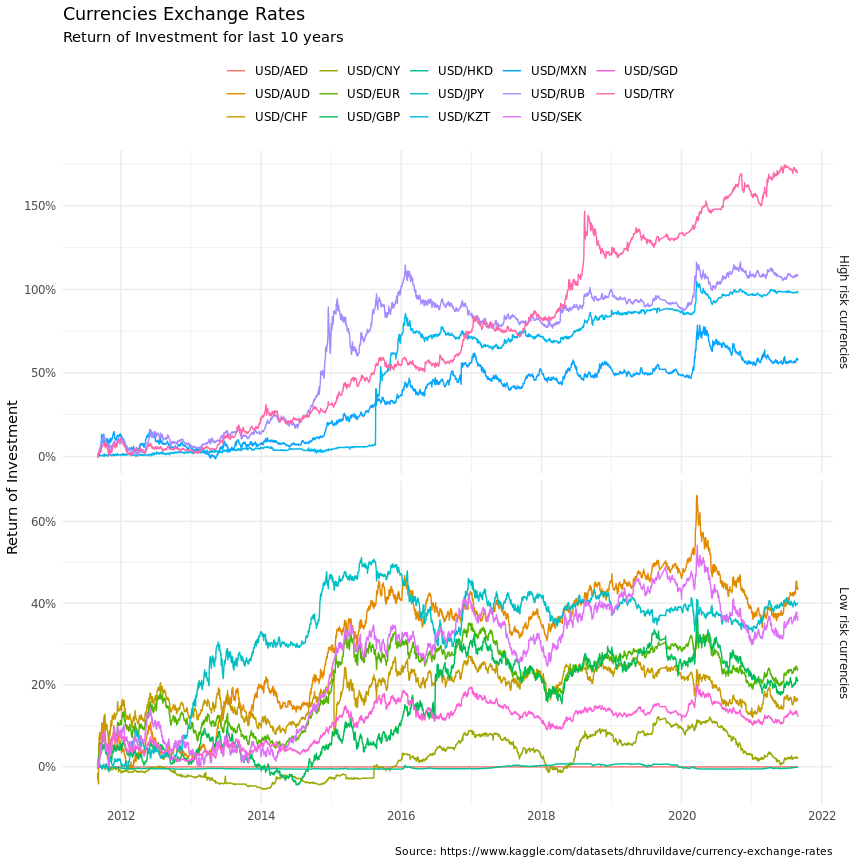

Currencies Analysis
================
04 April, 2022

***Analysis price of the my list of currencies.***

## Prepare

Install packages and set environment :earth asia:

`install.packages("azuremlsdk")`

``` r
options(max.print = 1e3, scipen = 999, width = 1e2)
options(stringsAsFactors = F)

suppressPackageStartupMessages({
  library(dplyr)
  library(tidyr)
  
  library(lubridate)
  library(stringr)
  
  library(gt)
  library(tidyverse)
  library(glue)
  
  library(ggplot2)
  
  library(azuremlsdk)
})
```

``` r
.azureml_dataset_name <- "Currencies"
```

Connect to Azure ML workspace:

``` r
ws <- azuremlsdk::load_workspace_from_config()
sprintf(
  "%s workspace located in %s region", ws$name, ws$location
)
```

    ## [1] "portf-opt-ws workspace located in westeurope region"

## Load dataset

WARNING: I used `currency exchange rates` data from [Kaggle
Dataset](https://www.kaggle.com/datasets/dhruvildave/currency-exchange-rates):

``` r
currencies_ds <- azuremlsdk::get_dataset_by_name(ws, name = .azureml_dataset_name)

sprintf(
  "Dataset name: %s. %s",
  currencies_ds$name, 
  currencies_ds$description
)
```

    ## [1] "Dataset name: Currencies. Source: https://www.kaggle.com/datasets/dhruvildave/currency-exchange-rates"

Get `USD/RUB` top higher rates:

``` r
quotes_df <- currencies_ds$to_pandas_dataframe()

# ~ 20 years, 150 currencies and 1.5M rows

quotes_df %>%
  filter(slug == "USD/RUB") %>%
  select(-slug) %>% 
  top_n(10) %>% 
  
  gt() %>%
  tab_header(
    title = "USD/RUB Rate",
    subtitle = glue("{min(quotes_df$date)} to {max(quotes_df$date)}")
  ) %>%
  fmt_date(
    columns = date,
    date_style = 6
  ) %>%
  fmt_number(
    columns = c(open, high, low, close)
  )
```

    ## Selecting by close


<table class="gt_table">
  <thead class="gt_header">
    <tr>
      <th colspan="5" class="gt_heading gt_title gt_font_normal" style>USD/RUB Rate</th>
    </tr>
    <tr>
      <th colspan="5" class="gt_heading gt_subtitle gt_font_normal gt_bottom_border" style>1996-10-30 to 2021-08-30</th>
    </tr>
  </thead>
  <thead class="gt_col_headings">
    <tr>
      <th class="gt_col_heading gt_columns_bottom_border gt_left" rowspan="1" colspan="1">date</th>
      <th class="gt_col_heading gt_columns_bottom_border gt_right" rowspan="1" colspan="1">open</th>
      <th class="gt_col_heading gt_columns_bottom_border gt_right" rowspan="1" colspan="1">high</th>
      <th class="gt_col_heading gt_columns_bottom_border gt_right" rowspan="1" colspan="1">low</th>
      <th class="gt_col_heading gt_columns_bottom_border gt_right" rowspan="1" colspan="1">close</th>
    </tr>
  </thead>
  <tbody class="gt_table_body">
    <tr><td class="gt_row gt_left">Jan 21, 2016</td>
<td class="gt_row gt_right">82.06</td>
<td class="gt_row gt_right">85.82</td>
<td class="gt_row gt_right">82.06</td>
<td class="gt_row gt_right">81.82</td></tr>
    <tr><td class="gt_row gt_left">Jan 22, 2016</td>
<td class="gt_row gt_right">80.61</td>
<td class="gt_row gt_right">81.26</td>
<td class="gt_row gt_right">77.94</td>
<td class="gt_row gt_right">82.90</td></tr>
    <tr><td class="gt_row gt_left">Jan 26, 2016</td>
<td class="gt_row gt_right">81.54</td>
<td class="gt_row gt_right">82.16</td>
<td class="gt_row gt_right">78.33</td>
<td class="gt_row gt_right">79.84</td></tr>
    <tr><td class="gt_row gt_left">Feb 3, 2016</td>
<td class="gt_row gt_right">79.56</td>
<td class="gt_row gt_right">79.75</td>
<td class="gt_row gt_right">77.87</td>
<td class="gt_row gt_right">79.71</td></tr>
    <tr><td class="gt_row gt_left">Feb 10, 2016</td>
<td class="gt_row gt_right">79.39</td>
<td class="gt_row gt_right">79.49</td>
<td class="gt_row gt_right">77.65</td>
<td class="gt_row gt_right">79.59</td></tr>
    <tr><td class="gt_row gt_left">Feb 12, 2016</td>
<td class="gt_row gt_right">79.36</td>
<td class="gt_row gt_right">79.74</td>
<td class="gt_row gt_right">78.59</td>
<td class="gt_row gt_right">79.77</td></tr>
    <tr><td class="gt_row gt_left">Mar 19, 2020</td>
<td class="gt_row gt_right">80.92</td>
<td class="gt_row gt_right">82.07</td>
<td class="gt_row gt_right">79.24</td>
<td class="gt_row gt_right">80.92</td></tr>
    <tr><td class="gt_row gt_left">Mar 23, 2020</td>
<td class="gt_row gt_right">79.72</td>
<td class="gt_row gt_right">81.34</td>
<td class="gt_row gt_right">79.49</td>
<td class="gt_row gt_right">79.84</td></tr>
    <tr><td class="gt_row gt_left">Mar 31, 2020</td>
<td class="gt_row gt_right">79.59</td>
<td class="gt_row gt_right">79.69</td>
<td class="gt_row gt_right">77.66</td>
<td class="gt_row gt_right">79.59</td></tr>
    <tr><td class="gt_row gt_left">Nov 3, 2020</td>
<td class="gt_row gt_right">80.55</td>
<td class="gt_row gt_right">80.57</td>
<td class="gt_row gt_right">79.05</td>
<td class="gt_row gt_right">80.52</td></tr>
  </tbody>
  
  
</table>


## Preprocessing data

Calculate `Return` and `Log Return` for last 10 years:

``` r
quotes_df %<>% 
  transmute(
    symbol = slug,
    price = close,
    date
  ) %>% 
  
  filter(
    str_detect(symbol, "USD/") &
    date > max(date) - lubridate::years(10)
  ) %>% 
  
  filter(!(symbol == "USD/RUB" & price < 1)) %>% 
  
  arrange(date) %>% 
  group_by(symbol) %>%
  
  mutate(
    return = c(NA_real_, diff(price))/lag(price),
    log_return = log(1 + return)
  ) %>% 
  na.omit
```

## Discover Data

Calculate statistics and `volatility`:

``` r
quotes_stats <- quotes_df %>% 

  summarise(
    max_price = max(price), 
    min_price = min(price),
    last_price = last(price),
    max_min_rate = max(price)/min(price),
    volatility = sd(log_return)
  )

quotes_stats %>% 
  mutate(
    `100x Volatility` = volatility*100
  ) %>% 
  arrange(volatility) %>% 
  select(-volatility) %>% 
  
  gt() %>% 
  tab_header(
    title = "The Least and The Most Volatile Currencies",
    subtitle = glue("{min(quotes_df$date)} to {max(quotes_df$date)}")
  ) %>%
  fmt_number(
    columns = c(max_price, min_price, max_min_rate, last_price, `100x Volatility`)
  )
```


<table class="gt_table">
  <thead class="gt_header">
    <tr>
      <th colspan="6" class="gt_heading gt_title gt_font_normal" style>The Least and The Most Volatile Currencies</th>
    </tr>
    <tr>
      <th colspan="6" class="gt_heading gt_subtitle gt_font_normal gt_bottom_border" style>2011-09-01 to 2021-08-30</th>
    </tr>
  </thead>
  <thead class="gt_col_headings">
    <tr>
      <th class="gt_col_heading gt_columns_bottom_border gt_left" rowspan="1" colspan="1">symbol</th>
      <th class="gt_col_heading gt_columns_bottom_border gt_right" rowspan="1" colspan="1">max_price</th>
      <th class="gt_col_heading gt_columns_bottom_border gt_right" rowspan="1" colspan="1">min_price</th>
      <th class="gt_col_heading gt_columns_bottom_border gt_right" rowspan="1" colspan="1">last_price</th>
      <th class="gt_col_heading gt_columns_bottom_border gt_right" rowspan="1" colspan="1">max_min_rate</th>
      <th class="gt_col_heading gt_columns_bottom_border gt_right" rowspan="1" colspan="1">100x Volatility</th>
    </tr>
  </thead>
  <tbody class="gt_table_body">
    <tr><td class="gt_row gt_left">USD/AED</td>
<td class="gt_row gt_right">3.67</td>
<td class="gt_row gt_right">3.67</td>
<td class="gt_row gt_right">3.67</td>
<td class="gt_row gt_right">1.00</td>
<td class="gt_row gt_right">0.01</td></tr>
    <tr><td class="gt_row gt_left">USD/HKD</td>
<td class="gt_row gt_right">7.85</td>
<td class="gt_row gt_right">7.75</td>
<td class="gt_row gt_right">7.79</td>
<td class="gt_row gt_right">1.01</td>
<td class="gt_row gt_right">0.03</td></tr>
    <tr><td class="gt_row gt_left">USD/KWD</td>
<td class="gt_row gt_right">0.31</td>
<td class="gt_row gt_right">0.27</td>
<td class="gt_row gt_right">0.30</td>
<td class="gt_row gt_right">1.16</td>
<td class="gt_row gt_right">0.16</td></tr>
    <tr><td class="gt_row gt_left">USD/CNY</td>
<td class="gt_row gt_right">7.18</td>
<td class="gt_row gt_right">6.03</td>
<td class="gt_row gt_right">6.47</td>
<td class="gt_row gt_right">1.19</td>
<td class="gt_row gt_right">0.23</td></tr>
    <tr><td class="gt_row gt_left">USD/DJF</td>
<td class="gt_row gt_right">177.72</td>
<td class="gt_row gt_right">172.00</td>
<td class="gt_row gt_right">177.50</td>
<td class="gt_row gt_right">1.03</td>
<td class="gt_row gt_right">0.28</td></tr>
    <tr><td class="gt_row gt_left">USD/SGD</td>
<td class="gt_row gt_right">1.46</td>
<td class="gt_row gt_right">1.20</td>
<td class="gt_row gt_right">1.34</td>
<td class="gt_row gt_right">1.21</td>
<td class="gt_row gt_right">0.33</td></tr>
    <tr><td class="gt_row gt_left">USD/SAR</td>
<td class="gt_row gt_right">3.77</td>
<td class="gt_row gt_right">3.30</td>
<td class="gt_row gt_right">3.75</td>
<td class="gt_row gt_right">1.14</td>
<td class="gt_row gt_right">0.39</td></tr>
    <tr><td class="gt_row gt_left">USD/GTQ</td>
<td class="gt_row gt_right">7.89</td>
<td class="gt_row gt_right">7.04</td>
<td class="gt_row gt_right">7.73</td>
<td class="gt_row gt_right">1.12</td>
<td class="gt_row gt_right">0.41</td></tr>
    <tr><td class="gt_row gt_left">USD/ILS</td>
<td class="gt_row gt_right">4.07</td>
<td class="gt_row gt_right">3.13</td>
<td class="gt_row gt_right">3.20</td>
<td class="gt_row gt_right">1.30</td>
<td class="gt_row gt_right">0.45</td></tr>
    <tr><td class="gt_row gt_left">USD/TTD</td>
<td class="gt_row gt_right">6.78</td>
<td class="gt_row gt_right">5.93</td>
<td class="gt_row gt_right">6.76</td>
<td class="gt_row gt_right">1.14</td>
<td class="gt_row gt_right">0.47</td></tr>
    <tr><td class="gt_row gt_left">USD/CAD</td>
<td class="gt_row gt_right">1.46</td>
<td class="gt_row gt_right">0.97</td>
<td class="gt_row gt_right">1.26</td>
<td class="gt_row gt_right">1.51</td>
<td class="gt_row gt_right">0.47</td></tr>
    <tr><td class="gt_row gt_left">USD/MYR</td>
<td class="gt_row gt_right">4.49</td>
<td class="gt_row gt_right">2.96</td>
<td class="gt_row gt_right">4.16</td>
<td class="gt_row gt_right">1.52</td>
<td class="gt_row gt_right">0.50</td></tr>
    <tr><td class="gt_row gt_left">USD/DKK</td>
<td class="gt_row gt_right">7.15</td>
<td class="gt_row gt_right">5.18</td>
<td class="gt_row gt_right">6.30</td>
<td class="gt_row gt_right">1.38</td>
<td class="gt_row gt_right">0.51</td></tr>
    <tr><td class="gt_row gt_left">USD/EUR</td>
<td class="gt_row gt_right">0.96</td>
<td class="gt_row gt_right">0.70</td>
<td class="gt_row gt_right">0.85</td>
<td class="gt_row gt_right">1.38</td>
<td class="gt_row gt_right">0.51</td></tr>
    <tr><td class="gt_row gt_left">USD/CRC</td>
<td class="gt_row gt_right">619.70</td>
<td class="gt_row gt_right">478.54</td>
<td class="gt_row gt_right">619.70</td>
<td class="gt_row gt_right">1.29</td>
<td class="gt_row gt_right">0.53</td></tr>
    <tr><td class="gt_row gt_left">USD/PHP</td>
<td class="gt_row gt_right">54.23</td>
<td class="gt_row gt_right">39.75</td>
<td class="gt_row gt_right">49.71</td>
<td class="gt_row gt_right">1.36</td>
<td class="gt_row gt_right">0.54</td></tr>
    <tr><td class="gt_row gt_left">USD/INR</td>
<td class="gt_row gt_right">77.57</td>
<td class="gt_row gt_right">45.70</td>
<td class="gt_row gt_right">73.29</td>
<td class="gt_row gt_right">1.70</td>
<td class="gt_row gt_right">0.54</td></tr>
    <tr><td class="gt_row gt_left">USD/RON</td>
<td class="gt_row gt_right">4.54</td>
<td class="gt_row gt_right">2.93</td>
<td class="gt_row gt_right">4.18</td>
<td class="gt_row gt_right">1.55</td>
<td class="gt_row gt_right">0.55</td></tr>
    <tr><td class="gt_row gt_left">USD/JPY</td>
<td class="gt_row gt_right">125.63</td>
<td class="gt_row gt_right">75.74</td>
<td class="gt_row gt_right">109.90</td>
<td class="gt_row gt_right">1.66</td>
<td class="gt_row gt_right">0.55</td></tr>
    <tr><td class="gt_row gt_left">USD/GBP</td>
<td class="gt_row gt_right">0.87</td>
<td class="gt_row gt_right">0.58</td>
<td class="gt_row gt_right">0.73</td>
<td class="gt_row gt_right">1.49</td>
<td class="gt_row gt_right">0.55</td></tr>
    <tr><td class="gt_row gt_left">USD/JMD</td>
<td class="gt_row gt_right">153.88</td>
<td class="gt_row gt_right">83.37</td>
<td class="gt_row gt_right">150.53</td>
<td class="gt_row gt_right">1.85</td>
<td class="gt_row gt_right">0.56</td></tr>
    <tr><td class="gt_row gt_left">USD/MKD</td>
<td class="gt_row gt_right">58.92</td>
<td class="gt_row gt_right">42.07</td>
<td class="gt_row gt_right">51.98</td>
<td class="gt_row gt_right">1.40</td>
<td class="gt_row gt_right">0.58</td></tr>
    <tr><td class="gt_row gt_left">USD/MDL</td>
<td class="gt_row gt_right">20.31</td>
<td class="gt_row gt_right">11.09</td>
<td class="gt_row gt_right">17.58</td>
<td class="gt_row gt_right">1.83</td>
<td class="gt_row gt_right">0.61</td></tr>
    <tr><td class="gt_row gt_left">USD/BDT</td>
<td class="gt_row gt_right">84.72</td>
<td class="gt_row gt_right">72.39</td>
<td class="gt_row gt_right">84.72</td>
<td class="gt_row gt_right">1.17</td>
<td class="gt_row gt_right">0.62</td></tr>
    <tr><td class="gt_row gt_left">USD/AUD</td>
<td class="gt_row gt_right">1.74</td>
<td class="gt_row gt_right">0.93</td>
<td class="gt_row gt_right">1.37</td>
<td class="gt_row gt_right">1.88</td>
<td class="gt_row gt_right">0.63</td></tr>
    <tr><td class="gt_row gt_left">USD/SEK</td>
<td class="gt_row gt_right">10.44</td>
<td class="gt_row gt_right">6.29</td>
<td class="gt_row gt_right">8.62</td>
<td class="gt_row gt_right">1.66</td>
<td class="gt_row gt_right">0.64</td></tr>
    <tr><td class="gt_row gt_left">USD/CHF</td>
<td class="gt_row gt_right">1.03</td>
<td class="gt_row gt_right">0.79</td>
<td class="gt_row gt_right">0.92</td>
<td class="gt_row gt_right">1.31</td>
<td class="gt_row gt_right">0.64</td></tr>
    <tr><td class="gt_row gt_left">USD/CZK</td>
<td class="gt_row gt_right">26.03</td>
<td class="gt_row gt_right">16.75</td>
<td class="gt_row gt_right">21.67</td>
<td class="gt_row gt_right">1.55</td>
<td class="gt_row gt_right">0.64</td></tr>
    <tr><td class="gt_row gt_left">USD/BWP</td>
<td class="gt_row gt_right">12.19</td>
<td class="gt_row gt_right">6.58</td>
<td class="gt_row gt_right">11.12</td>
<td class="gt_row gt_right">1.85</td>
<td class="gt_row gt_right">0.66</td></tr>
    <tr><td class="gt_row gt_left">USD/NZD</td>
<td class="gt_row gt_right">1.78</td>
<td class="gt_row gt_right">1.13</td>
<td class="gt_row gt_right">1.43</td>
<td class="gt_row gt_right">1.57</td>
<td class="gt_row gt_right">0.66</td></tr>
    <tr><td class="gt_row gt_left">USD/THB</td>
<td class="gt_row gt_right">36.43</td>
<td class="gt_row gt_right">28.07</td>
<td class="gt_row gt_right">32.45</td>
<td class="gt_row gt_right">1.30</td>
<td class="gt_row gt_right">0.67</td></tr>
    <tr><td class="gt_row gt_left">USD/LKR</td>
<td class="gt_row gt_right">199.43</td>
<td class="gt_row gt_right">106.22</td>
<td class="gt_row gt_right">199.43</td>
<td class="gt_row gt_right">1.88</td>
<td class="gt_row gt_right">0.67</td></tr>
    <tr><td class="gt_row gt_left">USD/KRW</td>
<td class="gt_row gt_right">1,262.93</td>
<td class="gt_row gt_right">999.83</td>
<td class="gt_row gt_right">1,165.89</td>
<td class="gt_row gt_right">1.26</td>
<td class="gt_row gt_right">0.70</td></tr>
    <tr><td class="gt_row gt_left">USD/RSD</td>
<td class="gt_row gt_right">118.47</td>
<td class="gt_row gt_right">70.05</td>
<td class="gt_row gt_right">99.29</td>
<td class="gt_row gt_right">1.69</td>
<td class="gt_row gt_right">0.70</td></tr>
    <tr><td class="gt_row gt_left">USD/UYU</td>
<td class="gt_row gt_right">45.31</td>
<td class="gt_row gt_right">18.08</td>
<td class="gt_row gt_right">42.53</td>
<td class="gt_row gt_right">2.51</td>
<td class="gt_row gt_right">0.71</td></tr>
    <tr><td class="gt_row gt_left">USD/PLN</td>
<td class="gt_row gt_right">4.28</td>
<td class="gt_row gt_right">2.87</td>
<td class="gt_row gt_right">3.86</td>
<td class="gt_row gt_right">1.49</td>
<td class="gt_row gt_right">0.72</td></tr>
    <tr><td class="gt_row gt_left">USD/HUF</td>
<td class="gt_row gt_right">338.26</td>
<td class="gt_row gt_right">188.61</td>
<td class="gt_row gt_right">294.66</td>
<td class="gt_row gt_right">1.79</td>
<td class="gt_row gt_right">0.74</td></tr>
    <tr><td class="gt_row gt_left">USD/MUR</td>
<td class="gt_row gt_right">42.55</td>
<td class="gt_row gt_right">26.50</td>
<td class="gt_row gt_right">42.55</td>
<td class="gt_row gt_right">1.61</td>
<td class="gt_row gt_right">0.79</td></tr>
    <tr><td class="gt_row gt_left">USD/MXN</td>
<td class="gt_row gt_right">25.34</td>
<td class="gt_row gt_right">11.98</td>
<td class="gt_row gt_right">20.14</td>
<td class="gt_row gt_right">2.11</td>
<td class="gt_row gt_right">0.80</td></tr>
    <tr><td class="gt_row gt_left">USD/NIO</td>
<td class="gt_row gt_right">35.13</td>
<td class="gt_row gt_right">22.05</td>
<td class="gt_row gt_right">35.00</td>
<td class="gt_row gt_right">1.59</td>
<td class="gt_row gt_right">0.84</td></tr>
    <tr><td class="gt_row gt_left">USD/KZT</td>
<td class="gt_row gt_right">454.34</td>
<td class="gt_row gt_right">174.15</td>
<td class="gt_row gt_right">427.18</td>
<td class="gt_row gt_right">2.61</td>
<td class="gt_row gt_right">0.84</td></tr>
    <tr><td class="gt_row gt_left">USD/QAR</td>
<td class="gt_row gt_right">3.90</td>
<td class="gt_row gt_right">3.00</td>
<td class="gt_row gt_right">3.64</td>
<td class="gt_row gt_right">1.30</td>
<td class="gt_row gt_right">0.95</td></tr>
    <tr><td class="gt_row gt_left">USD/TRY</td>
<td class="gt_row gt_right">8.78</td>
<td class="gt_row gt_right">1.71</td>
<td class="gt_row gt_right">8.38</td>
<td class="gt_row gt_right">5.12</td>
<td class="gt_row gt_right">0.97</td></tr>
    <tr><td class="gt_row gt_left">USD/ZAR</td>
<td class="gt_row gt_right">19.25</td>
<td class="gt_row gt_right">6.98</td>
<td class="gt_row gt_right">14.66</td>
<td class="gt_row gt_right">2.76</td>
<td class="gt_row gt_right">0.99</td></tr>
    <tr><td class="gt_row gt_left">USD/RUB</td>
<td class="gt_row gt_right">82.90</td>
<td class="gt_row gt_right">28.79</td>
<td class="gt_row gt_right">73.50</td>
<td class="gt_row gt_right">2.88</td>
<td class="gt_row gt_right">1.05</td></tr>
    <tr><td class="gt_row gt_left">USD/ZMW</td>
<td class="gt_row gt_right">22.64</td>
<td class="gt_row gt_right">5.11</td>
<td class="gt_row gt_right">15.82</td>
<td class="gt_row gt_right">4.43</td>
<td class="gt_row gt_right">1.06</td></tr>
    <tr><td class="gt_row gt_left">USD/BRL</td>
<td class="gt_row gt_right">5.89</td>
<td class="gt_row gt_right">1.58</td>
<td class="gt_row gt_right">5.19</td>
<td class="gt_row gt_right">3.72</td>
<td class="gt_row gt_right">1.08</td></tr>
    <tr><td class="gt_row gt_left">USD/ARS</td>
<td class="gt_row gt_right">97.70</td>
<td class="gt_row gt_right">4.10</td>
<td class="gt_row gt_right">97.70</td>
<td class="gt_row gt_right">23.85</td>
<td class="gt_row gt_right">1.11</td></tr>
    <tr><td class="gt_row gt_left">USD/TND</td>
<td class="gt_row gt_right">3.06</td>
<td class="gt_row gt_right">1.37</td>
<td class="gt_row gt_right">2.79</td>
<td class="gt_row gt_right">2.23</td>
<td class="gt_row gt_right">1.17</td></tr>
    <tr><td class="gt_row gt_left">USD/BGN</td>
<td class="gt_row gt_right">1.87</td>
<td class="gt_row gt_right">1.21</td>
<td class="gt_row gt_right">1.66</td>
<td class="gt_row gt_right">1.55</td>
<td class="gt_row gt_right">1.28</td></tr>
    <tr><td class="gt_row gt_left">USD/EGP</td>
<td class="gt_row gt_right">19.60</td>
<td class="gt_row gt_right">5.83</td>
<td class="gt_row gt_right">15.65</td>
<td class="gt_row gt_right">3.37</td>
<td class="gt_row gt_right">1.29</td></tr>
    <tr><td class="gt_row gt_left">USD/NOK</td>
<td class="gt_row gt_right">11.76</td>
<td class="gt_row gt_right">5.36</td>
<td class="gt_row gt_right">8.66</td>
<td class="gt_row gt_right">2.19</td>
<td class="gt_row gt_right">1.31</td></tr>
    <tr><td class="gt_row gt_left">USD/PEN</td>
<td class="gt_row gt_right">4.11</td>
<td class="gt_row gt_right">2.38</td>
<td class="gt_row gt_right">4.07</td>
<td class="gt_row gt_right">1.72</td>
<td class="gt_row gt_right">1.34</td></tr>
    <tr><td class="gt_row gt_left">USD/BYN</td>
<td class="gt_row gt_right">3.08</td>
<td class="gt_row gt_right">0.51</td>
<td class="gt_row gt_right">2.51</td>
<td class="gt_row gt_right">6.04</td>
<td class="gt_row gt_right">1.37</td></tr>
    <tr><td class="gt_row gt_left">USD/MAD</td>
<td class="gt_row gt_right">10.29</td>
<td class="gt_row gt_right">7.89</td>
<td class="gt_row gt_right">8.95</td>
<td class="gt_row gt_right">1.30</td>
<td class="gt_row gt_right">1.43</td></tr>
    <tr><td class="gt_row gt_left">USD/UAH</td>
<td class="gt_row gt_right">33.50</td>
<td class="gt_row gt_right">7.80</td>
<td class="gt_row gt_right">26.92</td>
<td class="gt_row gt_right">4.30</td>
<td class="gt_row gt_right">1.83</td></tr>
    <tr><td class="gt_row gt_left">USD/SDG</td>
<td class="gt_row gt_right">451.00</td>
<td class="gt_row gt_right">1.39</td>
<td class="gt_row gt_right">440.03</td>
<td class="gt_row gt_right">324.46</td>
<td class="gt_row gt_right">5.96</td></tr>
    <tr><td class="gt_row gt_left">USD/BND</td>
<td class="gt_row gt_right">1.43</td>
<td class="gt_row gt_right">0.66</td>
<td class="gt_row gt_right">1.34</td>
<td class="gt_row gt_right">2.18</td>
<td class="gt_row gt_right">6.29</td></tr>
    <tr><td class="gt_row gt_left">USD/XOF</td>
<td class="gt_row gt_right">647.00</td>
<td class="gt_row gt_right">58.00</td>
<td class="gt_row gt_right">555.47</td>
<td class="gt_row gt_right">11.16</td>
<td class="gt_row gt_right">6.44</td></tr>
    <tr><td class="gt_row gt_left">USD/IDR</td>
<td class="gt_row gt_right">16,504.80</td>
<td class="gt_row gt_right">892.00</td>
<td class="gt_row gt_right">14,370.00</td>
<td class="gt_row gt_right">18.50</td>
<td class="gt_row gt_right">6.58</td></tr>
    <tr><td class="gt_row gt_left">USD/HNL</td>
<td class="gt_row gt_right">24.90</td>
<td class="gt_row gt_right">3.00</td>
<td class="gt_row gt_right">23.83</td>
<td class="gt_row gt_right">8.30</td>
<td class="gt_row gt_right">8.14</td></tr>
    <tr><td class="gt_row gt_left">USD/MZN</td>
<td class="gt_row gt_right">78.49</td>
<td class="gt_row gt_right">3.30</td>
<td class="gt_row gt_right">63.11</td>
<td class="gt_row gt_right">23.78</td>
<td class="gt_row gt_right">8.77</td></tr>
    <tr><td class="gt_row gt_left">USD/ETB</td>
<td class="gt_row gt_right">45.23</td>
<td class="gt_row gt_right">1.00</td>
<td class="gt_row gt_right">45.06</td>
<td class="gt_row gt_right">45.23</td>
<td class="gt_row gt_right">9.26</td></tr>
    <tr><td class="gt_row gt_left">USD/TWD</td>
<td class="gt_row gt_right">33.73</td>
<td class="gt_row gt_right">1.80</td>
<td class="gt_row gt_right">27.77</td>
<td class="gt_row gt_right">18.72</td>
<td class="gt_row gt_right">9.86</td></tr>
    <tr><td class="gt_row gt_left">USD/PKR</td>
<td class="gt_row gt_right">168.15</td>
<td class="gt_row gt_right">2.00</td>
<td class="gt_row gt_right">165.63</td>
<td class="gt_row gt_right">84.07</td>
<td class="gt_row gt_right">12.69</td></tr>
    <tr><td class="gt_row gt_left">USD/UZS</td>
<td class="gt_row gt_right">10,653.20</td>
<td class="gt_row gt_right">83.00</td>
<td class="gt_row gt_right">10,646.89</td>
<td class="gt_row gt_right">128.35</td>
<td class="gt_row gt_right">12.93</td></tr>
    <tr><td class="gt_row gt_left">USD/GHS</td>
<td class="gt_row gt_right">573.00</td>
<td class="gt_row gt_right">1.00</td>
<td class="gt_row gt_right">5.98</td>
<td class="gt_row gt_right">573.00</td>
<td class="gt_row gt_right">13.74</td></tr>
    <tr><td class="gt_row gt_left">USD/ISK</td>
<td class="gt_row gt_right">147.04</td>
<td class="gt_row gt_right">2.00</td>
<td class="gt_row gt_right">126.65</td>
<td class="gt_row gt_right">73.52</td>
<td class="gt_row gt_right">16.09</td></tr>
    <tr><td class="gt_row gt_left">USD/PGK</td>
<td class="gt_row gt_right">3.51</td>
<td class="gt_row gt_right">0.29</td>
<td class="gt_row gt_right">3.51</td>
<td class="gt_row gt_right">11.89</td>
<td class="gt_row gt_right">16.18</td></tr>
    <tr><td class="gt_row gt_left">USD/MMK</td>
<td class="gt_row gt_right">1,642.00</td>
<td class="gt_row gt_right">6.23</td>
<td class="gt_row gt_right">1,642.00</td>
<td class="gt_row gt_right">263.65</td>
<td class="gt_row gt_right">16.59</td></tr>
    <tr><td class="gt_row gt_left">USD/CLP</td>
<td class="gt_row gt_right">867.50</td>
<td class="gt_row gt_right">5.00</td>
<td class="gt_row gt_right">782.21</td>
<td class="gt_row gt_right">173.50</td>
<td class="gt_row gt_right">18.70</td></tr>
    <tr><td class="gt_row gt_left">USD/SZL</td>
<td class="gt_row gt_right">1,189.00</td>
<td class="gt_row gt_right">1.07</td>
<td class="gt_row gt_right">14.91</td>
<td class="gt_row gt_right">1,111.21</td>
<td class="gt_row gt_right">18.79</td></tr>
    <tr><td class="gt_row gt_left">USD/XPF</td>
<td class="gt_row gt_right">119.35</td>
<td class="gt_row gt_right">1.00</td>
<td class="gt_row gt_right">100.90</td>
<td class="gt_row gt_right">119.35</td>
<td class="gt_row gt_right">19.32</td></tr>
    <tr><td class="gt_row gt_left">USD/SOS</td>
<td class="gt_row gt_right">1,670.00</td>
<td class="gt_row gt_right">6.00</td>
<td class="gt_row gt_right">571.00</td>
<td class="gt_row gt_right">278.33</td>
<td class="gt_row gt_right">29.77</td></tr>
    <tr><td class="gt_row gt_left">USD/MWK</td>
<td class="gt_row gt_right">812.43</td>
<td class="gt_row gt_right">1.00</td>
<td class="gt_row gt_right">804.55</td>
<td class="gt_row gt_right">812.43</td>
<td class="gt_row gt_right">30.83</td></tr>
    <tr><td class="gt_row gt_left">USD/NGN</td>
<td class="gt_row gt_right">412.50</td>
<td class="gt_row gt_right">1.00</td>
<td class="gt_row gt_right">411.00</td>
<td class="gt_row gt_right">412.50</td>
<td class="gt_row gt_right">31.65</td></tr>
    <tr><td class="gt_row gt_left">USD/VND</td>
<td class="gt_row gt_right">23,631.00</td>
<td class="gt_row gt_right">21.00</td>
<td class="gt_row gt_right">22,775.00</td>
<td class="gt_row gt_right">1,125.29</td>
<td class="gt_row gt_right">34.09</td></tr>
    <tr><td class="gt_row gt_left">USD/COP</td>
<td class="gt_row gt_right">4,174.75</td>
<td class="gt_row gt_right">3.67</td>
<td class="gt_row gt_right">3,805.25</td>
<td class="gt_row gt_right">1,136.67</td>
<td class="gt_row gt_right">37.09</td></tr>
    <tr><td class="gt_row gt_left">USD/IQD</td>
<td class="gt_row gt_right">1,578.00</td>
<td class="gt_row gt_right">10.00</td>
<td class="gt_row gt_right">1,458.00</td>
<td class="gt_row gt_right">157.80</td>
<td class="gt_row gt_right">37.10</td></tr>
    <tr><td class="gt_row gt_left">USD/MGA</td>
<td class="gt_row gt_right">3,931.18</td>
<td class="gt_row gt_right">0.30</td>
<td class="gt_row gt_right">3,808.00</td>
<td class="gt_row gt_right">12,910.29</td>
<td class="gt_row gt_right">46.29</td></tr>
    <tr><td class="gt_row gt_left">USD/SLL</td>
<td class="gt_row gt_right">10,250.50</td>
<td class="gt_row gt_right">1.00</td>
<td class="gt_row gt_right">10,250.50</td>
<td class="gt_row gt_right">10,250.50</td>
<td class="gt_row gt_right">47.59</td></tr>
  </tbody>
  
  
</table>


My broker trades the following pairs:

``` r
symbols  <- c(
  'RUB', 
  'EUR', 'GBP', 'CHF', 'CNY', 'HKD', 'JPY', 'SEK', 'SGD', 'AUD',  
  'AED', 'KZT', 'BYN', 'TRY', 'MXN'
)

symbols <- str_c("USD", symbols, sep = "/")


quotes_stats %>% 
  filter(
    symbol %in% symbols
  ) %>% 
  mutate(
    `100x Volatility` = volatility*100
  ) %>% 
  arrange(volatility) %>% 
  select(-volatility) %>% 
  
  gt() %>% 
  tab_header(
    title = "The Most Promised Currencies",
    subtitle = glue("{min(quotes_df$date)} to {max(quotes_df$date)}")
  ) %>%
  fmt_number(
    columns = c(max_price, min_price, last_price, max_min_rate, `100x Volatility`)
  )
```

<div id="arrslcwxgh" style="overflow-x:auto;overflow-y:auto;width:auto;height:auto;">

<table class="gt_table">
  <thead class="gt_header">
    <tr>
      <th colspan="6" class="gt_heading gt_title gt_font_normal" style>The Most Promised Currencies</th>
    </tr>
    <tr>
      <th colspan="6" class="gt_heading gt_subtitle gt_font_normal gt_bottom_border" style>2011-09-01 to 2021-08-30</th>
    </tr>
  </thead>
  <thead class="gt_col_headings">
    <tr>
      <th class="gt_col_heading gt_columns_bottom_border gt_left" rowspan="1" colspan="1">symbol</th>
      <th class="gt_col_heading gt_columns_bottom_border gt_right" rowspan="1" colspan="1">max_price</th>
      <th class="gt_col_heading gt_columns_bottom_border gt_right" rowspan="1" colspan="1">min_price</th>
      <th class="gt_col_heading gt_columns_bottom_border gt_right" rowspan="1" colspan="1">last_price</th>
      <th class="gt_col_heading gt_columns_bottom_border gt_right" rowspan="1" colspan="1">max_min_rate</th>
      <th class="gt_col_heading gt_columns_bottom_border gt_right" rowspan="1" colspan="1">100x Volatility</th>
    </tr>
  </thead>
  <tbody class="gt_table_body">
    <tr><td class="gt_row gt_left">USD/AED</td>
<td class="gt_row gt_right">3.67</td>
<td class="gt_row gt_right">3.67</td>
<td class="gt_row gt_right">3.67</td>
<td class="gt_row gt_right">1.00</td>
<td class="gt_row gt_right">0.01</td></tr>
    <tr><td class="gt_row gt_left">USD/HKD</td>
<td class="gt_row gt_right">7.85</td>
<td class="gt_row gt_right">7.75</td>
<td class="gt_row gt_right">7.79</td>
<td class="gt_row gt_right">1.01</td>
<td class="gt_row gt_right">0.03</td></tr>
    <tr><td class="gt_row gt_left">USD/CNY</td>
<td class="gt_row gt_right">7.18</td>
<td class="gt_row gt_right">6.03</td>
<td class="gt_row gt_right">6.47</td>
<td class="gt_row gt_right">1.19</td>
<td class="gt_row gt_right">0.23</td></tr>
    <tr><td class="gt_row gt_left">USD/SGD</td>
<td class="gt_row gt_right">1.46</td>
<td class="gt_row gt_right">1.20</td>
<td class="gt_row gt_right">1.34</td>
<td class="gt_row gt_right">1.21</td>
<td class="gt_row gt_right">0.33</td></tr>
    <tr><td class="gt_row gt_left">USD/EUR</td>
<td class="gt_row gt_right">0.96</td>
<td class="gt_row gt_right">0.70</td>
<td class="gt_row gt_right">0.85</td>
<td class="gt_row gt_right">1.38</td>
<td class="gt_row gt_right">0.51</td></tr>
    <tr><td class="gt_row gt_left">USD/JPY</td>
<td class="gt_row gt_right">125.63</td>
<td class="gt_row gt_right">75.74</td>
<td class="gt_row gt_right">109.90</td>
<td class="gt_row gt_right">1.66</td>
<td class="gt_row gt_right">0.55</td></tr>
    <tr><td class="gt_row gt_left">USD/GBP</td>
<td class="gt_row gt_right">0.87</td>
<td class="gt_row gt_right">0.58</td>
<td class="gt_row gt_right">0.73</td>
<td class="gt_row gt_right">1.49</td>
<td class="gt_row gt_right">0.55</td></tr>
    <tr><td class="gt_row gt_left">USD/AUD</td>
<td class="gt_row gt_right">1.74</td>
<td class="gt_row gt_right">0.93</td>
<td class="gt_row gt_right">1.37</td>
<td class="gt_row gt_right">1.88</td>
<td class="gt_row gt_right">0.63</td></tr>
    <tr><td class="gt_row gt_left">USD/SEK</td>
<td class="gt_row gt_right">10.44</td>
<td class="gt_row gt_right">6.29</td>
<td class="gt_row gt_right">8.62</td>
<td class="gt_row gt_right">1.66</td>
<td class="gt_row gt_right">0.64</td></tr>
    <tr><td class="gt_row gt_left">USD/CHF</td>
<td class="gt_row gt_right">1.03</td>
<td class="gt_row gt_right">0.79</td>
<td class="gt_row gt_right">0.92</td>
<td class="gt_row gt_right">1.31</td>
<td class="gt_row gt_right">0.64</td></tr>
    <tr><td class="gt_row gt_left">USD/MXN</td>
<td class="gt_row gt_right">25.34</td>
<td class="gt_row gt_right">11.98</td>
<td class="gt_row gt_right">20.14</td>
<td class="gt_row gt_right">2.11</td>
<td class="gt_row gt_right">0.80</td></tr>
    <tr><td class="gt_row gt_left">USD/KZT</td>
<td class="gt_row gt_right">454.34</td>
<td class="gt_row gt_right">174.15</td>
<td class="gt_row gt_right">427.18</td>
<td class="gt_row gt_right">2.61</td>
<td class="gt_row gt_right">0.84</td></tr>
    <tr><td class="gt_row gt_left">USD/TRY</td>
<td class="gt_row gt_right">8.78</td>
<td class="gt_row gt_right">1.71</td>
<td class="gt_row gt_right">8.38</td>
<td class="gt_row gt_right">5.12</td>
<td class="gt_row gt_right">0.97</td></tr>
    <tr><td class="gt_row gt_left">USD/RUB</td>
<td class="gt_row gt_right">82.90</td>
<td class="gt_row gt_right">28.79</td>
<td class="gt_row gt_right">73.50</td>
<td class="gt_row gt_right">2.88</td>
<td class="gt_row gt_right">1.05</td></tr>
    <tr><td class="gt_row gt_left">USD/BYN</td>
<td class="gt_row gt_right">3.08</td>
<td class="gt_row gt_right">0.51</td>
<td class="gt_row gt_right">2.51</td>
<td class="gt_row gt_right">6.04</td>
<td class="gt_row gt_right">1.37</td></tr>
  </tbody>
  
  
</table>
</div>

Plot exchange rate for out favorites:

Define low risk symbols:

``` r
usdrub_vol <- quotes_stats %>% filter(symbol == "USD/RUB") %>% pull(volatility)

low_risk_symbols <- quotes_stats %>% 
  filter(
    symbol %in% symbols &
    volatility <= usdrub_vol
  ) %>% 
  pull(symbol) %>% 
  unique

cat(
  sprintf(
    "['%s']",
    paste(low_risk_symbols, collapse = "', '")
))
```

    ## ['USD/AED', 'USD/AUD', 'USD/CHF', 'USD/CNY', 'USD/EUR', 'USD/GBP', 'USD/HKD', 'USD/JPY', 'USD/KZT', 'USD/MXN', 'USD/RUB', 'USD/SEK', 'USD/SGD', 'USD/TRY']

``` r
jumper_symbols <- quotes_stats %>% filter(max_min_rate > 2) %>% pull(symbol)

quotes_df %>% 
  filter(symbol %in% low_risk_symbols) %>% 
  mutate(
    jumper = if_else(symbol %in% jumper_symbols, "High risk currencies", "Low risk currencies")
  ) %>% 
  group_by(symbol) %>% 
  mutate(R = cumsum(return)) %>% 
  
  ggplot + 
    geom_line(aes(x = date, y = R, color = symbol)) +
    scale_y_continuous(labels = scales::percent_format(accuracy = 1)) +

    facet_grid(jumper ~ ., scales = "free") +
    
    labs(
      title = "Currencies Exchange Rates", subtitle = "Return of Investment for last 10 years",
      x = "", y = "Return of Investment", 
      caption = currencies_ds$description) +
    theme_minimal() +
  
    theme(
      legend.position = "top", legend.title = element_blank(),
      plot.caption = element_text(size = 8)
    )
```

<!-- -->
